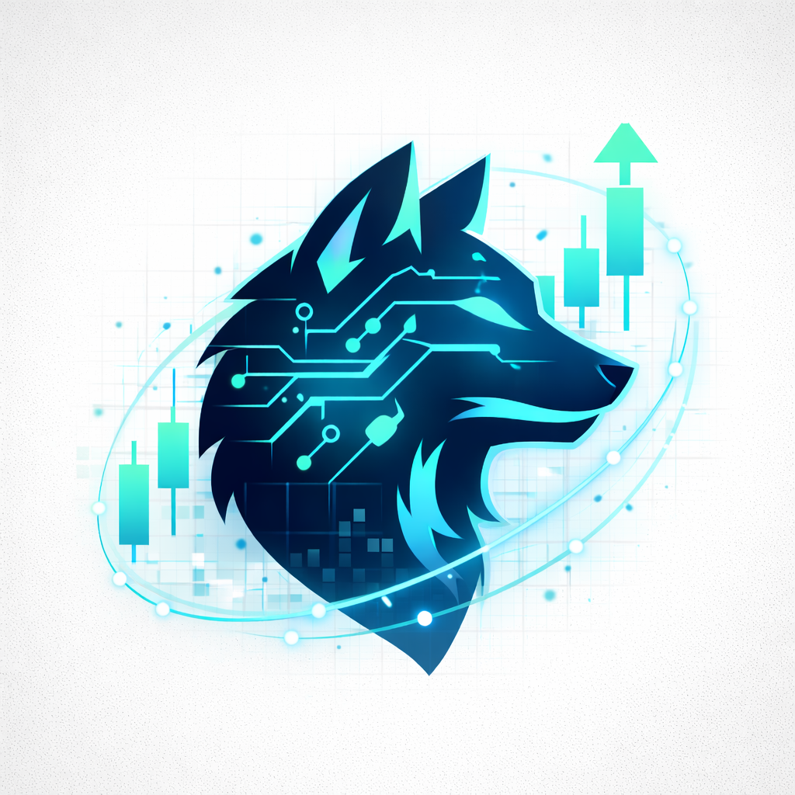
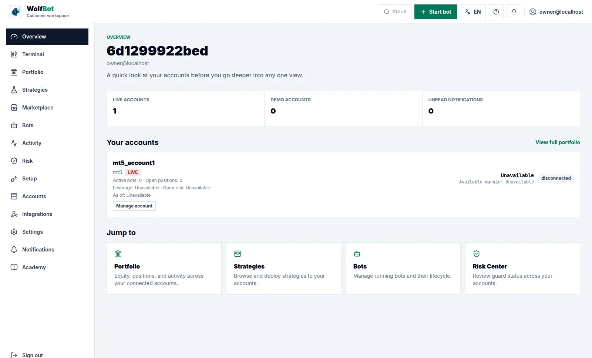
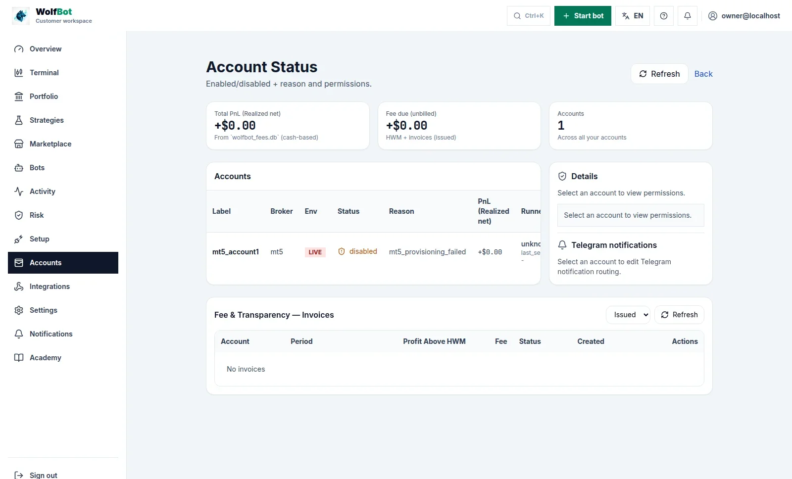

# WolfBot Community

<p align="center">
  
</p>

<h3 align="center">One Platform. Every Market.</h3>

<p align="center">
  <strong>Crypto exchanges and MT5 — Forex, Gold, Indices — unified in one trading platform: one interface, one risk engine, one portfolio.</strong>
</p>
<p align="center">
  The same trading engine as WolfBot Cloud. A free, self-hosted unified trading platform for Windows and Linux.
</p>

<p align="center">
  <a href="https://community.wolfbot.io/download">
    
  </a>
</p>

<p align="center">
  <a href="https://community.wolfbot.io">Website</a> ·
  <a href="https://community.wolfbot.io/getting-started">Getting Started</a> ·
  <a href="https://community.wolfbot.io/docs">Documentation</a> ·
  <a href="https://github.com/wolfbot-io/wolfbot-community/releases">Latest Release</a> ·
  <a href="https://github.com/wolfbot-io/wolfbot-community/discussions">Discussions</a>
</p>

<p align="center">
  
  
  
  
  
  
  
  
  <a href="LICENSE"></a>
</p>

---

## Latest Release — v0.1.0-beta.2

WolfBot Community **v0.1.0-beta.2** is the current Linux Public Beta.

Highlights:

- **TradingView webhook automation** — send `buy`, `sell`, `close_long` and `close_short` alerts into WolfBot's normal command ledger, dispatcher, execution layer and risk controls.
- **Signed Linux installers** — Ubuntu/Debian `.deb` plus self-extracting `.run` installer.
- **Digest-pinned runtime** — engine, control-api, gateway, webui, financial-publisher, periodic-jobs, worker-supervisor and outcome worker images are pinned by SHA256 digest in the signed release manifest.
- **One self-hosted platform** — Binance, Bybit, BingX, KuCoin, Bitget and MT5 support in one dashboard.
- **Simulation-first workflow** — test strategies, Smart Terminal orders and TradingView alerts before adding live keys.

Downloads:

| File | SHA256 |
|---|---|
| `WolfBot-Setup-linux-amd64.deb` | `b7cff2408b7ad6eafc6b374d2644202b15fb05ebe8c4bfdd72a12d4df91e2674` |
| `wolfbot-oneclick-0.1.0-beta.2.run` | `16896217809f8525f65d806a3cb76d5856d3fa6c51fabe037b92bcd87441f046` |

Read the full release notes: **[v0.1.0-beta.2](https://community.wolfbot.io/releases/0.1.0-beta.2)**.

> Public Beta note: this release is installable and signed, but it is not the Stable channel yet. Start with Simulation or a broker demo account before live trading.

---

## Stop Managing Markets in Separate Platforms

Trading infrastructure is fragmented.

One exchange app for crypto. Another for futures. MT5 terminal for Forex, Gold and Indices. Different dashboards for every account. Different bots for every platform. Separate risk tools scattered everywhere.

**WolfBot changes that.**

WolfBot is a **unified crypto and MT5 trading platform**: it connects your crypto exchanges (Binance, Bybit, BingX, KuCoin, Bitget) and your MT5 broker (Forex, Gold, Indices, Stocks/CFDs) into the exact same interface, the same risk engine, and the same portfolio view — no more juggling separate apps per market. **WolfBot Community is that exact same platform, free to install and run on your own Windows or Linux machine.**

```text
                  CRYPTO EXCHANGES
                        │
Binance ──── Bybit ──── BingX ──── KuCoin ──── Bitget
            │            │            │             │
            └────────────┼────────────┼─────────────┘
                         │
                         ▼
                      WOLFBOT
                 Unified Trading Platform
                         │
              ┌──────────┼──────────┐
              │          │          │
          Trading      Risk     Portfolio
          Engine      Engine    Management
              │          │          │
              └──────────┼──────────┘
                         │
                         ▼
                  ONE INTERFACE
                         ▲
                         │
            ┌────────────┼────────────┐
            │            │            │
        Forex ────  Gold ────  Indices ──── Stocks/CFDs
                         │
                    MT5 BROKERS
```

---

## The Same WolfBot — Just Running on Your Machine

WolfBot Community isn't a stripped-down trial. It's **the identical trading engine, strategies and broker support as WolfBot Cloud** — the only real difference is *where it runs*. Cloud runs it on WolfBot's managed servers; Community runs it on the computer sitting in front of you. That one difference is what makes Community more convenient and more secure for a lot of traders:

|  | |
|---|---|
| ⚡ **More convenient** | No signup, no subscription, nothing to wait on. Download, install, connect a broker, and you're trading — on hardware you already own and control, on your own schedule. |
| 🔒 **More secure** | Your API keys, trading data and strategies never leave your machine — there's no cloud database, no shared infrastructure, no third party in the loop. Combined with trade-only API keys, your funds stay on the exchange no matter what. |
| 💸 **Zero cost, forever** | The full unified platform — crypto, futures and MT5 — for $0. No per-trade fees, no subscription tiers. Your only cost is the electricity your machine already uses. |
| 🛠️ **Full control** | Your machine, your rules. Nobody can pause your trading, force an update, or discontinue a service on you. Open development on GitHub — inspect, extend, or self-host indefinitely. |

```text
WolfBot Cloud:
Your browser → WolfBot's managed server → Exchange

WolfBot Community:
Your machine → Exchange (directly — nothing in between)
```

Not sure which fits you? **[Community has the identical trading engine as Cloud](https://community.wolfbot.io/community-vs-cloud)** — the honest breakdown is a two-minute read, not a sales pitch.

### WolfBot vs a Typical Trading Bot

A typical trading bot connects to **one exchange → one API → one strategy → one market**.

WolfBot unifies **multiple exchanges + multiple brokers + crypto + MT5 markets** under one platform:

| | Typical Bot | WolfBot Community |
|---|---|---|
| **Markets** | One exchange | Crypto + Futures + MT5 |
| **Interface** | One dashboard per bot | One unified interface |
| **Risk** | Per-bot or none | Unified risk across all markets |
| **Portfolio** | Per-exchange | One portfolio — all markets |
| **Execution** | Direct to exchange | Unified execution layer |
| **Cost** | Varies (free to $$$) | Free |

---

## What's Inside

| Feature | | Feature | |
|---|---|---|---|
| 🌐 **Unified Markets** | Crypto exchanges + MT5 (Forex, Gold, Indices). One platform. | 🎯 **Smart Execution** | Unified order routing across all markets. |
| 🖥️ **One Interface** | Accounts, positions, orders — one dashboard. | 🛡️ **Unified Risk** | Position limits and drawdown guards across everything. |
| 📊 **One Portfolio** | Single portfolio view over all connected markets. | 🤖 **Automation** | Multi-strategy bots, TradingView signals, pipelines. |
| 🧪 **Simulation** | Paper-trade across markets risk-free. | 💻 **Smart Terminal** | Manual trading with risk-aware execution. |
| 🔄 **Auto Updates** | Stay current with signed channel updates. | 💾 **Backup & Restore** | Snapshot-based backup and recovery. |

[Full feature breakdown →](https://community.wolfbot.io/features)

---

## Install in Minutes

### Windows (installer coming in a follow-up release)
```powershell
# 1. Download Setup.exe from community.wolfbot.io/download
# 2. Double-click → Install → Open WolfBot
# 3. Connect a Demo account first — real market data, zero risk, no real funds
```

### Linux (Ubuntu/Debian)
```bash
cd ~/Downloads
sudo apt install ./WolfBot-Setup-linux-amd64.deb
wolfbot                        # opens the local setup wizard
```

> Docker is installed automatically. The setup wizard opens on `http://127.0.0.1:8080/portal/local/setup`.

**[→ Download WolfBot Community](https://community.wolfbot.io/download)** · [Windows Guide](https://community.wolfbot.io/install/windows) · [Linux Guide](https://community.wolfbot.io/install/linux)

---

## Screenshots

<p align="center">
  
  
  <br/>
  <sub>Dashboard · Account Status — captured from a real self-hosted WolfBot Community instance</sub>
</p>

---

## Supported Markets

### Crypto & Futures
| Exchange | Status | Features |
|---|---|---|
| **Binance** | ✅ Stable | Spot, Futures, Demo, Terminal, Strategies |
| **Bybit** | ✅ Stable | Spot, Futures, Demo, Terminal, Strategies |
| **BingX** | ✅ Stable | Standard, Perpetual Futures, Demo, Terminal |
| **KuCoin** | ✅ Stable | Spot, Futures, Demo, Terminal, Strategies |
| **Bitget** | ✅ Stable | Spot, Futures, Demo, Terminal, Strategies |

### Traditional Markets via MT5 (Windows & Linux)
| Market | Status | Instruments |
|---|---|---|
| **Forex** | ✅ Stable | EUR/USD, GBP/USD, USD/JPY, etc. |
| **Metals** | ✅ Stable | XAU/USD Gold, XAG/USD Silver, and more |
| **Indices** | ✅ Stable | US30, NAS100, S&P 500, etc. |
| **Stocks/CFDs** | ✅ Stable | Broker-dependent |

> MT5 works on both platforms: natively on Windows, or via WolfBot's built-in MT5 terminal container (browser VNC access) on Linux — no separate Windows machine needed. See the [MT5 connect guide](https://community.wolfbot.io/brokers/mt5) for both paths.

---

## Security — Non-Custodial by Design

Running on your own machine isn't just more convenient, it removes an entire category of risk that cloud-hosted tools carry: there is no third-party server holding your keys, and no shared infrastructure for an attacker to target.

- 🔑 **Trade-only API keys** — withdrawal and transfer permissions disabled at the exchange level, not just a software toggle. Even a compromised key can't move funds.
- 💻 **Self-hosted** — API keys, trading data and strategies stay on your machine. No cloud database, no third party in the loop.
- ✍️ **Signed releases** — every installer is cryptographically signed. Checksums are published so you can verify before installing.
- 🧪 **Demo-friendly** — connect a broker Demo/testnet account first (real market data, virtual funds). Test strategies across every market before ever adding a Live key.
- 🔒 **Non-custodial** — WolfBot never holds your funds. Your money stays on the exchange, and you can revoke access at any time.

[Read our full security policy →](https://community.wolfbot.io/security)

---

## Community vs Cloud — Same Engine, Different Hosting

**Is Community a "limited" version of Cloud? No.** Community runs the identical trading engine, strategies and broker support as Cloud — crypto, futures and MT5, all included. The only real difference is who manages the infrastructure.

| | WolfBot Community | WolfBot Cloud |
|---|---|---|
| **Cost** | Free | Subscription |
| **Hosting** | Your machine | Managed by WolfBot.io |
| **Setup** | Install & configure | Ready in minutes |
| **Updates** | Channel-based auto-update | Automatic |
| **Support** | Community (Discussions) | Direct support |
| **Customization** | Full access — your machine, your rules | Within platform |

| Feature | Community | Cloud |
|---|---|---|
| Crypto / Futures / MT5 Trading | ✅ | ✅ |
| Smart Terminal · Risk Controls · Simulation | ✅ | ✅ |
| Multi-Broker · TradingView Signals · Custom Strategies | ✅ | ✅ |
| Auto Updates · Backup & Restore | ✅ | ✅ |
| 24/7 Operation | ✅ (while your machine is on) | ✅ Always |
| Managed hosting, team features, direct support | ❌ | ✅ |

[Detailed comparison →](https://community.wolfbot.io/community-vs-cloud)

---

## Quick Start

1. [Download WolfBot Community](https://community.wolfbot.io/download)
2. [Install on Windows](https://community.wolfbot.io/install/windows) or [Linux](https://community.wolfbot.io/install/linux)
3. [Read Getting Started](https://community.wolfbot.io/getting-started)
4. [Start with Simulation](https://community.wolfbot.io/docs/simulation) — zero risk
5. [Connect a broker](https://community.wolfbot.io/brokers) — start with a demo account

---

## Documentation

| Category | Guides |
|---|---|
| **Getting Started** | [Overview](https://community.wolfbot.io/getting-started) · [Windows Install](https://community.wolfbot.io/install/windows) · [Linux Install](https://community.wolfbot.io/install/linux) |
| **Trading** | [Smart Terminal](https://community.wolfbot.io/docs/smart-terminal) · [Risk Controls](https://community.wolfbot.io/docs/risk-controls) · [Simulation](https://community.wolfbot.io/docs/simulation) |
| **Brokers** | [Bybit](https://community.wolfbot.io/brokers/bybit) · [Binance](https://community.wolfbot.io/brokers/binance) · [BingX](https://community.wolfbot.io/brokers/bingx) · [KuCoin](https://community.wolfbot.io/brokers/kucoin) · [Bitget](https://community.wolfbot.io/brokers/bitget) · [MT5](https://community.wolfbot.io/brokers/mt5) · [API Key Guide](https://community.wolfbot.io/brokers/api-key-guide) |
| **Platform** | [Updates](https://community.wolfbot.io/docs/updates) · [Backup & Restore](https://community.wolfbot.io/docs/backup) · [Release Channels](https://community.wolfbot.io/releases/channels) · [Troubleshooting](https://community.wolfbot.io/docs/troubleshooting) |
| **Reference** | [Community vs Cloud](https://community.wolfbot.io/community-vs-cloud) · [Self-Hosted Explained](https://community.wolfbot.io/docs/self-hosted-explained) · [Security](https://community.wolfbot.io/security) |

---

## Community

- 💬 [GitHub Discussions](https://github.com/wolfbot-io/wolfbot-community/discussions) — Q&A, ideas, strategies, show & tell
- 🐛 [GitHub Issues](https://github.com/wolfbot-io/wolfbot-community/issues) — Bug reports, feature requests, broker issues
- 🗺️ [Public Roadmap](https://github.com/orgs/wolfbot-io/projects/1) — What we're building next
- 🌐 [Community Website](https://community.wolfbot.io) — Full documentation & guides
- ☁️ [WolfBot Cloud](https://wolfbot.io) — Managed WolfBot experience

---

## Official Links

| | |
|---|---|
| 🌐 **Website** | [community.wolfbot.io](https://community.wolfbot.io) |
| 📦 **Downloads** | [community.wolfbot.io/download](https://community.wolfbot.io/download) |
| 🚀 **Releases** | [GitHub Releases](https://github.com/wolfbot-io/wolfbot-community/releases) |
| ☁️ **WolfBot Cloud** | [wolfbot.io](https://wolfbot.io) |

---

<p align="center">
  <strong>WolfBot Community</strong> — <em>One Platform. Every Market.</em><br/>
  <sub>The same WolfBot, running on your machine — free, private, and yours to control.</sub><br/>
  <sub>Built with ❤️ by <a href="https://wolfbot.io">WolfBot.io</a></sub>
</p>
